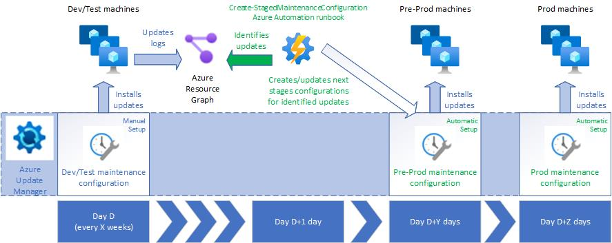

# Azure Update Manager Tools

This repository contains tools for managing [Azure Update Manager](https://learn.microsoft.com/en-us/azure/update-center/overview) scenarios.

## Staged Patching with Azure Automation

With a staged patching solution, OS updates are first deployed in a test environment and are later deployed in pre-production and production environments, ensuring the latter environments only get the very specific updates initially deployed in the test environment. With this approach, you significantly decrease the chances of having an OS update breaking a production system.

The typical setup of staging patching can be as follows:

1. Dev/Test machines of a specific OS type/version are recurrently patched (e.g., every few weeks) for all update classifications (stage 0).
1. Each Dev/Test patch cycle ends with a specific set of updates (e.g., specific Windows KB IDs or Linux package versions) that were successfully installed across all Dev/Test machines.
1. Pre-production machines are patched a few days later (stage 1) with the very specific updates that were deployed in Dev/Test (stage 0).
1. Production machines are patched one or two weeks later (stage 2) with the same updates that were deployed and tested in Dev/Test (stage 0) and Pre-Production (stage 1).

This staged patching approach can be implemented with the help of the [Create-StagedMaintenanceConfiguration.ps1](./Create-StagedMaintenanceConfiguration.ps1) PowerShell script, which runs after stage 0 and automates stages 1 and 2. This script can be, for example, deployed as an Azure Automation Runbook scheduled to run after the Dev/Test recurrent update cycle (see diagram below). It works for both Windows and Linux scenarios (Azure VMs and Azure Arc-enabled servers).



### Recommended staged patching strategy

The value of a staged patching solution is to ensure that patches deployed in a production environment are previously tested in non-production environments. The more consistent and repeatable the patching workflow is, the more confidence you have in the patches that reach production. For this reason, it is recommended to define maintenance configurations specifically for each OS version and ensure further stages are applied only to machines of the same OS version. For example, if your environment has a mix of Windows 2016, Windows 2019, Ubuntu 20.4, and Ubuntu 22.4 servers, you should define four different staged patching workflows, one for each OS version. With this approach, for example, Windows 2019 production machines will only get patches that were tested in similar Windows 2019 non-production machines and, similarly, Ubuntu 20.4 production servers will only get package updates that were tested in Ubuntu 20.4 non-production servers.

Tagging is your best friend in this strategy. By tagging your servers according to their OS version and patching stage, it will be easier to dynamically define the scope of a specific patching stage. Continuing with the example above, your servers can be tagged as follows:

* A `aum-stage` tag for each of the patching stages (e.g., `aum-stage`=`dev`, `aum-stage`=`preprod`, `aum-stage`=`prod`, `aum-stage`=`prod-ha-instance1`, `aum-stage`=`prod-ha-instance2`, etc.).
* A `os-name` tag for each of the OS versions of your environment (e.g., `os-name`=`windows2016`, `os-name`=`windows2019`, `os-name`=`ubuntu20`, `os-name`=`ubuntu22`, etc.)

You can choose whatever tagging strategy that meets your staged patching requirements, provided you end up with a predictable patching workflow. Once you have tagged all your servers according to their stage in the different patching workflows, you have to define a stage 0 recurring Maintenance Configuration (e.g., for servers tagged `aum-stage`=`dev`), for each of the OS versions. For the next stages, you have two options to leverage this solution:

1. Schedule the [Create-StagedMaintenanceConfiguration](./Create-StagedMaintenanceConfiguration.ps1) runbook to run after stage 0 (e.g., the next day) and configure it to create/update all the next stages (e.g., stages 1, 2, etc.) based on the results of stage 0.
1. Chain all the stages to each other, by scheduling the [Create-StagedMaintenanceConfiguration](./Create-StagedMaintenanceConfiguration.ps1) runbook for each of the stages before production:
  * After stage 0, create/update stage 1 based on the results of stage 0
  * After stage 1, create/update stage 2 based on the results of stage 1
  * etc.

**IMPORTANT**: you must ensure the last stage (production) is not scheduled before the next iteration of the phase 0 stage, otherwise you will end up having the production Maintenance Configuration overwritten with a new schedule/patch selection before it is actually deployed. Also, bear in mind that, as [Azure Resource Graph keeps the patching results history for up to 30 days](https://learn.microsoft.com/en-us/azure/update-center/query-logs), your updates cycle must not exceed this interval.

Validating the quality of the patching stages before production is one important perspective not addressed by this solution. It is not sufficient to patch dev/test servers - we must ensure the patches pass minimum quality tests before reaching production. At this moment, you must run a parallel process that performs this validation (e.g., automated tests running in the patched servers). As soon as Azure Update Manager supports pre- and post-tasks ([planned for the last quarter of 2023](https://learn.microsoft.com/en-us/azure/update-center/whats-upcoming)), we will be able to integrate quality assurance in this solution.

### Pre-requisites

* The machines in the scope of this solution must be [supported by Azure Update Manager](https://learn.microsoft.com/en-us/azure/update-center/support-matrix) and fulfill its [pre-requisites](https://learn.microsoft.com/en-us/azure/update-center/overview?tabs=azure-vms#prerequisites).
* The machines in the scope of this solution must have the [Customer Managed Schedules patch orchestration mode](https://learn.microsoft.com/en-us/azure/update-center/manage-update-settings), a pre-requisite for [scheduled patching](https://learn.microsoft.com/en-us/azure/update-center/scheduled-patching).
* At least one recurrent scheduled patching Maintenance Configuration covering a part of the machines in scope. As this maintenance configuration will serve as the reference for the following patching stages, it should be assigned to non-production machines and, ideally, recur every few weeks. See the above recommendations for an effective patching strategy.
* An Azure Automation Account with an associated Managed Identity (can be a system or user-assigned identity) and the following modules installed: `Az.Accounts`, `Az.Resources`, and `Az.ResourceGraph`. This solution is based on an Automation Account, but you can use other approaches, such as Azure Functions.
* The Automation Account Managed Identity must have the following **minimum** permissions (as a custom role) on the subscription where the reference maintenance configuration was created:
  * */read
  * Microsoft.Maintenance/maintenanceConfigurations/write
  * Microsoft.Maintenance/configurationAssignments/write
  * Microsoft.Resources/deployments/*

### Setup instructions

1. Ensure your Azure VMs and Azure Arc-enabled servers are tagged according to the staged patching strategy you defined (see above). Use tags to group your servers according to their patching phase and OS version.
1. Create a recurrent scheduled patching Maintenance Configuration for Phase 0 of each OS version in your environment. See instructions [here](https://learn.microsoft.com/en-us/azure/update-center/scheduled-patching?tabs=schedule-updates-single-machine%2Cschedule-updates-scale-overview#schedule-recurring-updates-at-scale). Assign this Maintenance Configuration to the servers that will serve as the initial testbed for your patches. You can assign servers either directly to the Maintenance Configuration or dynamically, with a [Dynamic Scope](https://learn.microsoft.com/en-us/azure/update-center/manage-dynamic-scoping).
1. Create or reuse an [Azure Automation Account](https://learn.microsoft.com/en-us/azure/automation/automation-create-standalone-account).
1. Install all required Automation Account modules (`Az.Accounts` and `Az.Resources` are usually built-in, but `Az.ResourceGraph` is not). See [here](https://learn.microsoft.com/en-us/azure/automation/shared-resources/modules#import-az-modules) how to install additional modules.
1. Assign a Managed Identity to the Automation Account and grant it the required privileges (see pre-requisites above).
1. Import the [Create-StagedMaintenanceConfiguration.ps1](./Create-StagedMaintenanceConfiguration.ps1) Runbook into the Automation Account, by following [these steps](https://learn.microsoft.com/en-us/azure/automation/manage-runbooks#import-a-runbook). Download the runbook first to your local machine. The runbook must be configured as PowerShell 5.1. Don't forget to publish the runbook (draft runbooks cannot be scheduled).
1. Create an [Azure Automation schedule](https://learn.microsoft.com/en-us/azure/automation/shared-resources/schedules#create-a-schedule) for each of the Phase 0 Maintenance Configurations (one per OS version). The schedule must have the same frequency as the Maintenance Configuration it refers to, with at least an 8-hour offset. For example, if the Maintenance Configuration is scheduled on Mondays, every 2 weeks at 8:00 p.m., then the respective Azure Automation schedule should be scheduled on Tuesdays, every 2 weeks at least at 4:00 a.m.
1. Link the `Create-StagedMaintenanceConfiguration` runbook to each of the schedules and specify its parameters according to the instructions below. To obtain the Maintenance Configuration ID, check the "Properties" blade of the Maintenance Configuration.
1. (Optional) If you prefer to adopt a more conservative chained staged approach, you need to create additional schedules (for further stages before production) and link them to the same runbook. In this case, you will have to anticipate the Maintenance Configuration IDs that will result from the previous stages' executions, which will be in the form `/subscriptions/<phase 0 maintenance configuration subscription ID>/resourceGroups/<phase 0 maintenance configuration resource group>/providers/Microsoft.Maintenance/maintenanceConfigurations/<previous stage name>`.

### Pre- and post-maintenance tasks

Pre- and post-maintenance tasks in Azure Update Manager follow an event-based architecture, in which you subscribe to events coming from a system topic associated to the Configuration Maintenance, and use, for example, an Azure Automation runbook or Azure Function as the destination of the event. You can learn more about how to configure pre- and post-maintenance in the Azure Update Manager [pre and post events overview](https://learn.microsoft.com/en-us/azure/update-manager/pre-post-scripts-overview), and also on the [how-to guide](https://learn.microsoft.com/en-us/azure/update-manager/manage-pre-post-events) and tutorials for [Azure Automation](https://learn.microsoft.com/en-us/azure/update-manager/tutorial-webhooks-using-runbooks) and [Azure Functions](https://learn.microsoft.com/en-us/azure/update-manager/tutorial-using-functions). You can find in this repository a code sample for one of the pre- and post-maintenance scenarios: turn machines on with [Start-StagedMaintenanceVMs.ps1](./Start-StagedMaintenanceVMs.ps1) and turn them off with [Deallocate-StagedMaintenanceVMs.ps1](,/Deallocate-StagedMaintenanceVMs.ps1).

NOTE: the staged patching solution here described does not propagate pre- and post-maintenance tasks coming from the reference maintenance configuration to the following stages, but you can manually configure them once the subsequent stages have been created for the first time.

### Create-StagedMaintenanceConfiguration script parameters

The [Create-StagedMaintenanceConfiguration.ps1](./Create-StagedMaintenanceConfiguration.ps1) PowerShell script receives the following parameters:

- `MaintenanceConfigurationId`: Azure Resource Manager ID of the Maintenance Configuration to be used as a reference to create maintenance configurations for further stages
- `NextStagePropertiesJson`: JSON-formatted parameter that will define the scope of the next maintenance configurations, with the following schema:

```json
{
  "$schema": "http://json-schema.org/draft-04/schema#",
  "type": "array",
  "items": [
    {
      "type": "object",
      "properties": {
        "stageName": {
          "type": "string"
        },
        "offsetDays": {
          "type": "integer"
        },
        "scope": {
          "type": "array",
          "items": [
            {
              "type": "string"
            }
          ]
        },
        "filter": {
          "type": "object",
          "properties": {
            "resourceTypes": {
              "type": "array",
              "items": [
                {
                  "type": "string"
                }
              ]
            },
            "resourceGroups": {
              "type": "array",
              "items": [
                {
                  "type": "string"
                }
              ]
            },
            "tagSettings": {
              "type": "object",
              "properties": {
                "tags": {
                  "type": "object",
                  "properties": {
                    "tagName1": {
                      "type": "array",
                      "items": [
                        {
                          "type": "string"
                        }
                      ]
                    },
                    "tagNameN": {
                      "type": "array",
                      "items": [
                        {
                          "type": "string"
                        }
                      ]
                    }
                  }
                },
                "filterOperator": {
                  "type": "string"
                }
              },
              "required": [
                "tags",
                "filterOperator"
              ]
            },
            "locations": {
              "type": "array",
              "items": [
                {
                  "type": "string"
                }
              ]
            },
            "osTypes": {
              "type": "array",
              "items": [
                {
                  "type": "string"
                }
              ]
            }
          }
        }
      },
      "required": [
        "stageName",
        "offsetDays",
        "scope",
        "filter"
      ]
    }
  ]
}
```

The example below implements a scenario in which the Pre-Production and Production stages are deployed respectively 7 days and 14 days after the reference maintenance configuration (Dev/Test). The maintenance scope is targeted at two subscriptions (`00000000-0000-0000-0000-000000000000` and `00000000-0000-0000-0000-000000000001`), for
both Windows Azure VMs and Azure Arc-enabled servers tagged with `aum-stage=preprod|prod` and `os-name=windows2019`. The `filter` property follows the format defined
for Maintenance Configuration Assignments ([see reference](https://learn.microsoft.com/en-us/azure/templates/microsoft.maintenance/configurationassignments?pivots=deployment-language-arm-template)).

```json
[
    {
        "stageName": "windows2019-preprod",
        "offsetDays": 7,
        "scope": [
            "/subscriptions/00000000-0000-0000-0000-000000000000",
            "/subscriptions/00000000-0000-0000-0000-000000000001"
        ],
        "filter": {
            "resourceTypes": [
                "microsoft.compute/virtualmachines",
                "microsoft.hybridcompute/machines"
            ],
            "resourceGroups": [
            ],
            "tagSettings": {
                "tags": {
                    "aum-stage": [
                        "preprod"
                    ],
                    "os-name": [
                        "windows2019"
                    ]
                },
                "filterOperator": "All"
            },
            "locations": [],
            "osTypes": [
                "Windows"
            ]
        }
    },
    {
        "stageName": "windows2019-prod",
        "offsetDays": 14,
        "scope": [
            "/subscriptions/00000000-0000-0000-0000-000000000000",
            "/subscriptions/00000000-0000-0000-0000-000000000001"
        ],
        "filter": {
            "resourceTypes": [
                "microsoft.compute/virtualmachines",
                "microsoft.hybridcompute/machines"
            ],
            "resourceGroups": [
            ],
            "tagSettings": {
                "tags": {
                    "aum-stage": [
                        "prod"
                    ],
                    "os-name": [
                        "windows2019"
                    ]
                },
                "filterOperator": "All"
            },
            "locations": [],
            "osTypes": [
                "Windows"
            ]
        }
    }
]
```

### Disclaimer

This solution is not supported under any Microsoft standard support program or service. The scripts are provided AS IS without warranty of any kind. The entire risk arising out of the use or performance of the scripts and documentation remains with you.